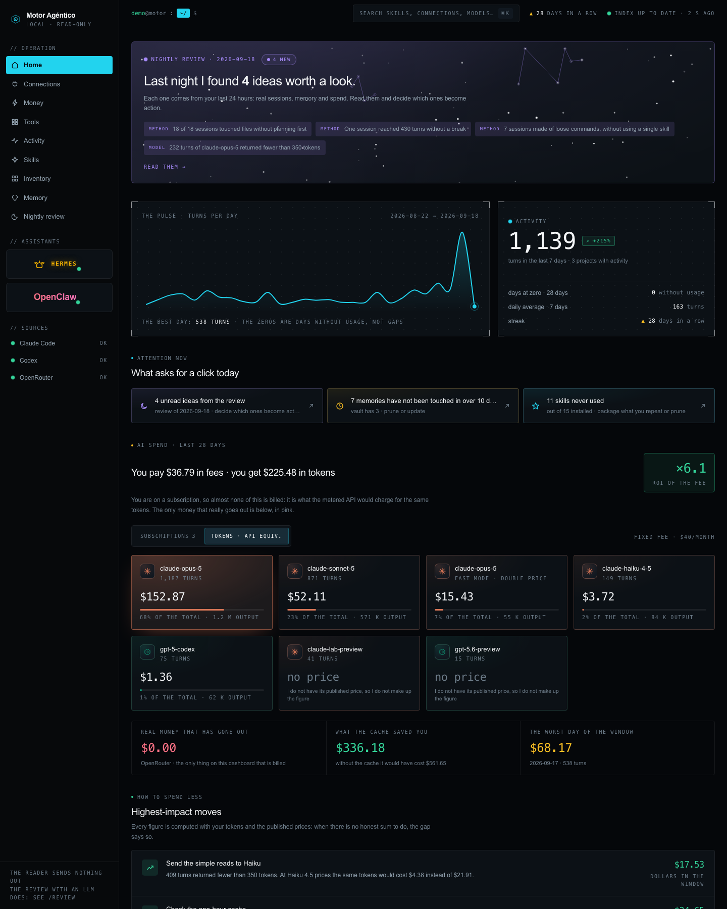
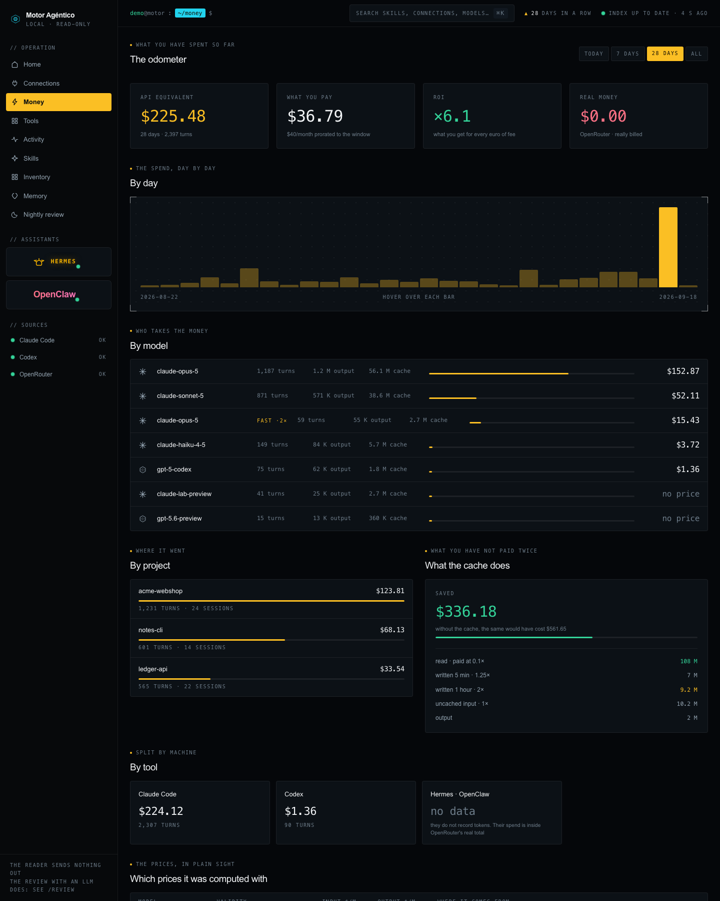
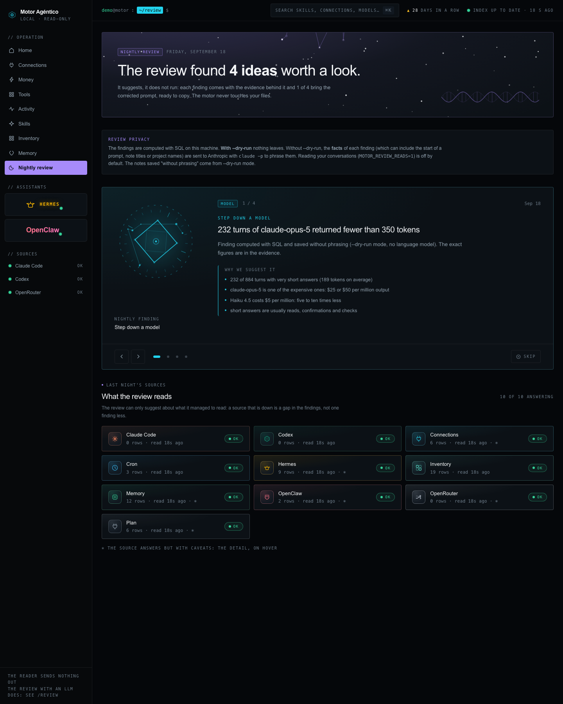
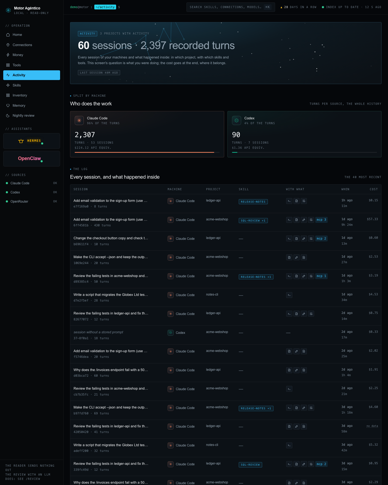
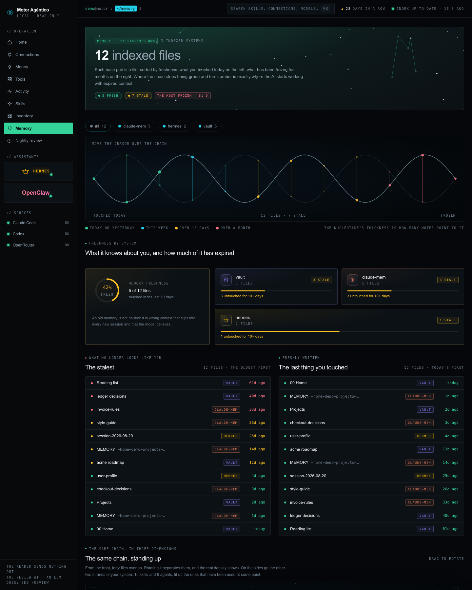
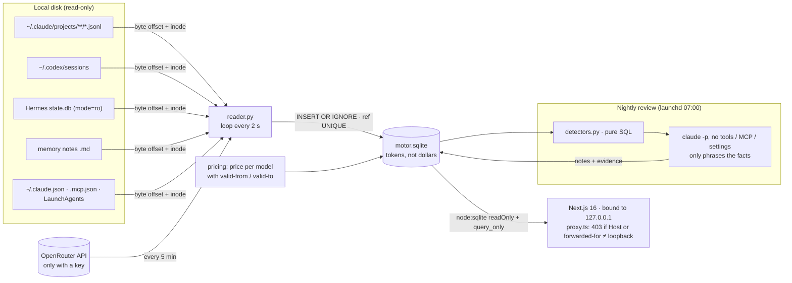

# Motor Agéntico · agentic usage observability

Local, **read-only** observability for AI coding agents (Claude Code, Codex,
Hermes Agent, OpenClaw, OpenRouter): an incremental JSONL → SQLite reader in
plain Python, a token-based cost model with dated pricing, a Next.js 16
dashboard that opens the database with `readOnly: true`, and a nightly review
in which SQL finds the facts and an LLM is only allowed to phrase them.

> **Extracted from a personal tool in regular use since August 2026** and
> published with a synthetic data generator. The author's real dataset
> (prompts, transcripts, spend) is **not** part of this repository.
>
> **Do not deploy it.** It has no authentication by design, reads your local
> transcripts and only answers on `127.0.0.1`.


<sub>All screenshots are taken from `make demo`: invented projects, example.com addresses, generated numbers.</sub>

---

## The problem

When you use several coding agents every day, three questions have no answer
in any single place:

1. **What does this actually cost?** Subscriptions hide per-token cost, prices
   change on fixed dates, and each tool logs usage differently (or not at all).
2. **What do I really use?** Hundreds of installed skills, agents and MCP
   servers, and no way to know which ones were ever invoked.
3. **What could I do better?** Patterns like building without a plan, a
   marathon session or a cache that never hits only show up in the logs.

Sending transcripts to a SaaS to answer that was not acceptable, so the tool
reads the files that the agents already write on disk, keeps an index in
SQLite, and never writes anywhere else.

## What it shows

| Screen | Question it answers |
|---|---|
| **Home** | last night's review · spend vs subscription · how to spend less · what runs unattended |
| **Money** (`/money`) | by model, day, project and tool · cache savings · the auditable price table |
| **Tools** (`/tools`) | each agent, what the tool can and cannot know about its spend |
| **Connections** (`/connections`) | Claude connectors and MCP servers *declared*, crossed with real invocations |
| **Skills** / **Inventory** (`/skills`, `/inventory`) | installed vs actually invoked |
| **Activity** (`/activity`) | every session and its cost · timeline of prompts |
| **Memory** (`/memory`) | freshness of memory notes, `[[link]]` graph, broken links counted apart |
| **Nightly review** (`/review`) | findings with their evidence and a copy-paste prompt |
| **Hermes · OpenClaw** (`/machines/hermes`, `/machines/openclaw`) | per-agent boards from their own config and state |

| | |
|---|---|
|  |  |
|  |  |

All eleven screens are in [`docs/screenshots/`](docs/screenshots/) (regenerate with `make screenshots` while `make demo` is running).

## Architecture



- **Reader** (`reader/`, Python 3.11+, standard library only). The only
  component that writes, and only to its own database. One module per source
  in `reader/sources/`; a failing source rolls back, records the error in
  `health` and does not stop the others.
- **Schema** (`reader/schema.sql`): 18 tables in one file, plus additive
  migrations for new columns. **Breaking change in this version:** tables,
  columns, `MOTOR_*` variables and the launchd log were renamed to English, so a
  `motor.sqlite` from an earlier checkout is not migrated. Start from a fresh
  database; the reader rebuilds it from the transcripts still on disk.
- **Web** (`web/`, Next.js 16, React 19, Tailwind v4). Server components only,
  no API routes, no server actions, no database driver: `node:sqlite` opened
  read-only, plus `PRAGMA query_only = ON` checked at startup as a second lock.
- **Exposure.** The real boundary is that the scripts bind to `127.0.0.1`.
  `proxy.ts` is a second lock against DNS rebinding and naive tunnels: it
  returns 403 when `Host` is not loopback or when `X-Forwarded-For`,
  `X-Forwarded-Host`, `Forwarded` or `X-Real-IP` name a non-loopback client or
  host (Next.js fills some of them with loopback values itself). Headers
  are client-controlled, so a proxy that rewrites `Host` and strips those
  headers, or a LAN client forging `Host: localhost` against `-H 0.0.0.0`,
  would get through. It is not authentication.
- **Nightly review** (`reader/review.py`). Detectors are SQL
  (`detectors.py`, `habits.py`); the model receives computed facts and runs
  with `--tools ""`, `--strict-mcp-config`, `--setting-sources ""` and an empty
  working directory: no built-in tools, no MCP servers, no user hooks or
  `CLAUDE.md`. Its output is only stored as text. The facts contain untrusted
  text taken from transcripts (the start of a prompt, note titles), so prompt
  injection can at worst change the wording of a note. Notes quoting the user
  are dropped unless the **whole** quote (normalised for case, quotes and
  spacing, at least 12 characters) appears in something the user wrote.
  *These hardened flags were added while extracting this repo and have not
  been run against the real CLI yet (no LLM calls were made during the
  extraction); the demonstrated runs used an earlier allow/deny-list.*

## Design decisions (summary)

Full reasoning, written while building it: [`docs/DECISIONS.md`](docs/DECISIONS.md).

1. **A separate local app**, never a section of something deployable.
2. **SQLite even though a full re-read took under a second**: history must
   survive transcript rotation, and the lag is always shown on screen.
3. **Compare the inode, not just the path**, or a rotated file is read from
   the middle, silently.
4. **Store tokens, compute money at read time** against prices with validity
   dates and a source. Unknown price → `NULL`, never `0`.
5. **`error` and `note` are different columns**: "Hermes does not record
   tokens" is a caveat, not an outage.
6. **`ref UNIQUE` caught a ×2.3 spend overcount** (see Lessons).
7. **No text box that sends anything**: read-only as a property, not a promise.
8. **`process.getBuiltinModule("node:sqlite")`** to dodge the bundler, and
   `{...row}` to fix null-prototype rows breaking React serialisation.
9. **Hand-written, deterministic force graph**; broken links are counted, not drawn.

## Run it

Requirements: **Python 3.11+**, **Node.js ≥ 22.15** (unflagged `node:sqlite`
and `module.registerHooks` for the web tests; also declared in
`web/package.json` `engines`), `make`, `curl`.
Tested locally with Python 3.14 and Node 26 on macOS, including from a clean
clone; CI is configured for Python 3.11/3.12 and Node 22 on Ubuntu.

```bash
make demo      # synthetic home → 2 reader passes (with a file rotation) → review --dry-run → web
               # open http://127.0.0.1:8797
make test      # pytest + ruff + node:test + tsc (creates .venv with pytest and ruff)
make demo-data  # only the synthetic data and the reader passes, no web
make clean      # delete data/, .pytest_tmp and web/.next
```

With npm 11, `npm ci` may warn that `sharp` has unapproved install scripts.
It is harmless here: `sharp` comes with Next.js for `next/image`, which this
dashboard does not use.

`make demo` never looks at your real home: the Makefile sets **every** source
path (`MOTOR_HOME`, `MOTOR_CLAUDE`, `MOTOR_CLAUDE_JSON`, `MOTOR_CODEX`,
`MOTOR_HERMES`, `MOTOR_OPENCLAW`, `MOTOR_LAUNCHAGENTS`, …) inside `data/demo/`,
so values exported in your shell profile cannot leak in, and
`demo/check_env.py` aborts the demo if any resolved path falls outside
it. `launchctl`/`hermes` commands are disabled, OpenRouter keys and the CLI
overrides are unset, and the review runs in dry mode (`--dry-run`), so **nothing
is sent anywhere**. It uses port 8797 so it cannot be confused with an instance
on real data (default 8796).

On your own data:

```bash
python3 reader/reader.py --loop      # or ./start.sh for reader + web together
python3 reader/review.py --dry-run   # findings only: no LLM, no network
```

Configuration is environment variables only — see [`.env.example`](.env.example)
(names only). Paths are stored relative to your home (`~/…`). For something that
survives a reboot there are launchd templates in [`launchd/`](launchd/)
(replace `__PYTHON__` with a Python 3.11+ interpreter: macOS's `/usr/bin/python3` is 3.9).

### What leaves the machine

| Component | Sends data? |
|---|---|
| Reader, all sources except OpenRouter | No. Files are read; other programs' databases are opened `mode=ro` |
| OpenRouter source | Calls `openrouter.ai` with **your** key, only if `OPENROUTER_API_KEY` is set |
| Nightly review with `--dry-run` | No LLM call, and its reader pre-pass skips OpenRouter. The pre-pass still runs list-only local commands (`launchctl list`, `hermes cron list`); disable them with `MOTOR_CRON_COMMANDS=0` |
| Nightly review without `--dry-run` | **Yes.** The pre-pass may query OpenRouter if a key is set, and the facts of each finding go to Anthropic via `claude -p`. Facts can include the start of a prompt, memory note titles and project names |
| `MOTOR_REVIEW_READS=1` (off by default) | **Yes.** Excerpts of the last 24 h of conversations, to look for patterns |
| Web | No. Read-only, loopback only |

## Honest status

Figures from the author's real usage, **aggregated, cut off before 2026-09-13**
(later sessions were affected by the portfolio review itself). The dataset is
not published. "Capability" means it worked end-to-end at least once with
evidence; "sustained use" means it kept running in practice.

| Piece | Capability | Evidence | Sustained use |
|---|---|---|---|
| Claude Code ingestion (usage, prompts, tool invocations) | **Demonstrated** | Roughly 23,000 usage rows between 18 Jul 2026 and the cut-off; reader loop running continuously since 31 Aug with no tracebacks in its log | **Yes** |
| Dedup by `ref UNIQUE` (the ×2.3) | **Demonstrated** | 6,948 of 11,286 lines were repeats (≈ ×2.6 lines per message); the hand-made spend figure was ×2.3 too high. *Illustrated*, not reproduced, by the demo: its generator deliberately writes ~2.3 lines per message and the reader keeps one row per message (`tests/test_claude_code.py`) | Yes, implicit in the whole series |
| Re-read on rotation (inode) | **Implemented and tested** | `tests/test_tail.py` and the rotation step in `make demo`. No logged rotation event in real use | — |
| Codex ingestion | **Demonstrated** | about 1,100 usage rows from mid-July to mid-September; no Codex use after that, not a failure | Yes, while Codex was in use |
| Hermes Agent: sessions and skill usage | **Demonstrated** | Session count matched Hermes' own `state.db` | Yes (re-reads all its rows every pass; not incremental) |
| Hermes / OpenClaw token spend | **Not available** | Those tools do not record tokens; shown as "no data" with the reason | — |
| OpenRouter real spend (total) | **Demonstrated** | Periodic (not daily) readings stored since 23 Aug | Yes |
| OpenRouter per-model breakdown | **Not demonstrated** | Needs a management key that was never configured | — |
| Web dashboard, read-only (11 screens) | **Demonstrated** | Dev server (`next dev`) kept running on `127.0.0.1` since 23 Aug. Production build (`next build && next start`) verified on synthetic data for this repo | Yes (dev server) |
| Nightly review: SQL detectors + LLM phrasing | **Demonstrated** | ~85 notes over 19 days; total LLM cost of the review ≈ $3.22; two failed runs visible in its log; a few missed days when the laptop was asleep. The stricter no-tools flags in this repo are not yet exercised against the real CLI | **Yes** |
| Review notes that quote the user, verified quote | **Demonstrated** (weaker check) | In real use only the first 60 characters of the quote were checked. This repo checks the whole quote (`tests/test_review.py`), a stricter version not yet run on real data | Yes (this is the mode that sends prompt excerpts; now off by default) |
| "Recommendations applied" | **Not demonstrated** | No note was ever marked applied. `resolved` is set automatically when the condition stops holding ("no longer holds" on screen) | — |
| Functional health check of agents | **Not demonstrated** | See Limits | — |
| Portability to another machine | **Implemented; verified locally** | All paths via `MOTOR_*`; `make test` and `make demo` pass from a clean clone on macOS, and the Ubuntu CI workflow passes on GitHub | — |

## Limits

- **Local and single-user.** No auth, no multi-tenant anything. Loopback only.
- **No functional health check.** The tool reads files and database rows; it
  does not prove that an agent's tools answer. In real use it showed an agent
  as **healthy while that agent's MCP tools had been down for about 20 days**:
  the process was alive and its database kept growing, so every signal the
  tool measured was green.
- **Hermes and OpenClaw do not record tokens**, so their spend is shown empty;
  their real cost is inside the OpenRouter total.
- **`resolved` is automatic.** It means "the condition is gone", not "someone
  followed the advice". The tool cannot know why.
- **Prices are a hand-maintained table** with a source and a date; OpenAI
  prices are marked unverified. Valid-from dates before the first known price
  change (`2026-01-01`) are a placeholder, not the real launch date. A model
  without a price is counted apart.
- **Subscriptions are example values** (`Plan A`, `Plan B`, 20 USD each) in
  `reader/pricing.py`; put your own there.
- **Declared ≠ working** for connections too: a Claude connector is listed
  because `~/.claude.json` says it was connected at some point.
- **Sanitised display.** MCP URLs keep only scheme, host and path (query
  dropped, token-like segments masked); LaunchAgents keep only the executable
  and an argument count; Hermes sessions without a display name get a short
  hash instead of their session key (which can contain a chat id).
- **Subscription window usage is unknown**: Claude Code does not persist it;
  only rate-limit rejections are recorded.
- **macOS-centric extras**: the scheduled-jobs source reads LaunchAgents and
  can call `launchctl list`. The core reader and the web run anywhere (CI is Ubuntu).
- Not done: incremental Hermes reads, log rotation for the reader loop,
  an OpenTelemetry exporter.

## Lessons

**1 · The first result was proving the author wrong (×2.3).** Claude Code
writes one JSONL line per content block, each repeating the same `usage`
object. The previous hand-made spend calculation summed every line. Making the
message id `UNIQUE` and inserting with `INSERT OR IGNORE` turned the reader
idempotent and, as a side effect, showed that the earlier spend figure was
2.3 times too high (6,948 of 11,286 lines were repeats). Nothing about the
inflated total looked wrong; only a constraint in the schema could catch it.

**2 · Process health ≠ function health.** The dashboard's health model is "the
last read of this source succeeded". That is honest about the *reader*, but it
said nothing about whether the agent could still do its job: for weeks it
showed green for an agent whose tools were failing. Measuring that requires
exercising the function (e.g. calling an MCP server), which this tool
deliberately does not do. The UI now says "declared" instead of implying
"working".

## Tests and CI

- `tests/` (pytest, 39 tests, no network, no real home): incremental reading
  (offset, half-written line, rotation by inode, truncation, independent
  cursors), dedup and the new-rows counter, cost with the price in force vs
  expired vs unknown, `error` vs `note`, a crashing source not stopping the
  others, migrating an old database, the 18-table schema, the review with
  `subprocess` mocked (invented quote and real-prefix/invented-tail quote
  discarded, fenced JSON, no-tools flags and empty working directory,
  conversation reading off by default, dry run never calls the model nor
  OpenRouter), and privacy checks (MCP env variable names and URL secrets never
  stored, LaunchAgent arguments dropped, Hermes session keys hashed, no account
  email, no absolute home paths, the demo guard flags paths outside `data/demo`).
- `web/tests/` (`node:test`): `db.ts` rejects `INSERT`/`DELETE`/`DROP`/`CREATE TEMP`
  with a read-only error and has `query_only` on; loopback host detection and
  forwarding-header checks (Next's own loopback values pass, remote ones fail)
  used by the 403 guard.
- `.github/workflows/ci.yml` (runs on every push and pull request): ruff + pytest
  (3.11, 3.12); `npm ci`, `next build` (generates the route types), `tsc`,
  node tests; and a job that runs `make demo` and `curl`s three screens plus a
  spoofed `Host` and a remote `X-Forwarded-For`, both expecting 403.

## Repository layout

```
reader/            reader, schema, pricing, nightly review (Python, stdlib)
  sources/         one module per source
web/               Next.js dashboard (read-only)
demo/              synthetic home generator
tests/             pytest suite
docs/              DECISIONS.md, screenshots
launchd/           plist templates (__REPO__, __HOME__, __PYTHON__ placeholders)
scripts/           headless-Chrome screenshots of the demo
```

## Naming

Code, UI and docs are in English. Two names are kept as they are: the product
name, **Motor Agéntico** (Spanish for "agentic engine", hence the `MOTOR_*`
variables and `motor.sqlite`), and **multiverso**, the name of the external
project its optional source reads. The nightly review's LLM prompts in
`reader/review.py` are deliberately still in Spanish (see the comment there).
The facts they receive are now in English; how that mix affects the notes has
not been checked against a live model yet.

## Credits and third parties

- Reads data produced by **Claude Code** (Anthropic), **Codex CLI** (OpenAI),
  **Hermes Agent** by Nous Research (MIT license), **OpenClaw** and the **OpenRouter** API. It is not affiliated
  with any of them.
- MCP servers are listed as described by the
  **[Model Context Protocol](https://modelcontextprotocol.io)** specification.
- Built with **Next.js**, **React** and **Tailwind CSS** (MIT). Anthropic
  prices were copied from the model table in Claude Code's `claude-api` skill
  (cached 2026-06-24), as noted in `reader/pricing.py`, not from the public
  pricing page; OpenAI prices are unverified.
- The optional `multiverso` source reads an index produced by the author's
  public `multiverso-context-engine` project; it is off unless
  `MOTOR_MULTIVERSO` is set.
- Brand icons in `web/src/components/Brands.tsx` are simplified hand-drawn
  glyphs used only to label where a number comes from; trademarks belong to
  their owners.
- The private original also has a **Remotion** video pipeline; it is not
  included here because its assets were screenshots of real data.
- The "never deployed · read-only · no fake zeros" rules were inspired by a
  public video about local agent dashboards.

## License

[MIT](LICENSE) © 2026 Noel Aliaga
